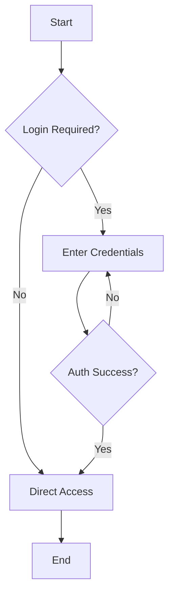
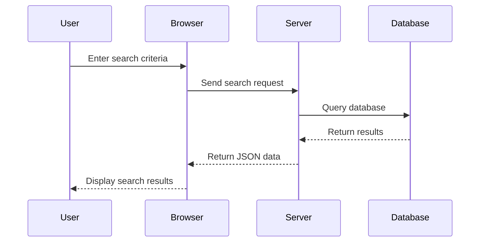
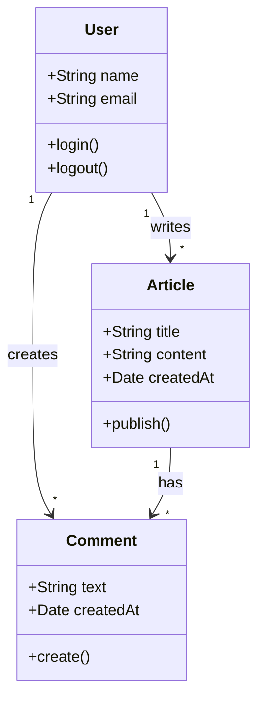
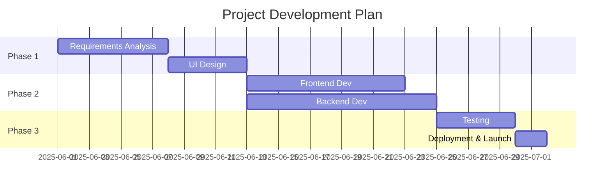
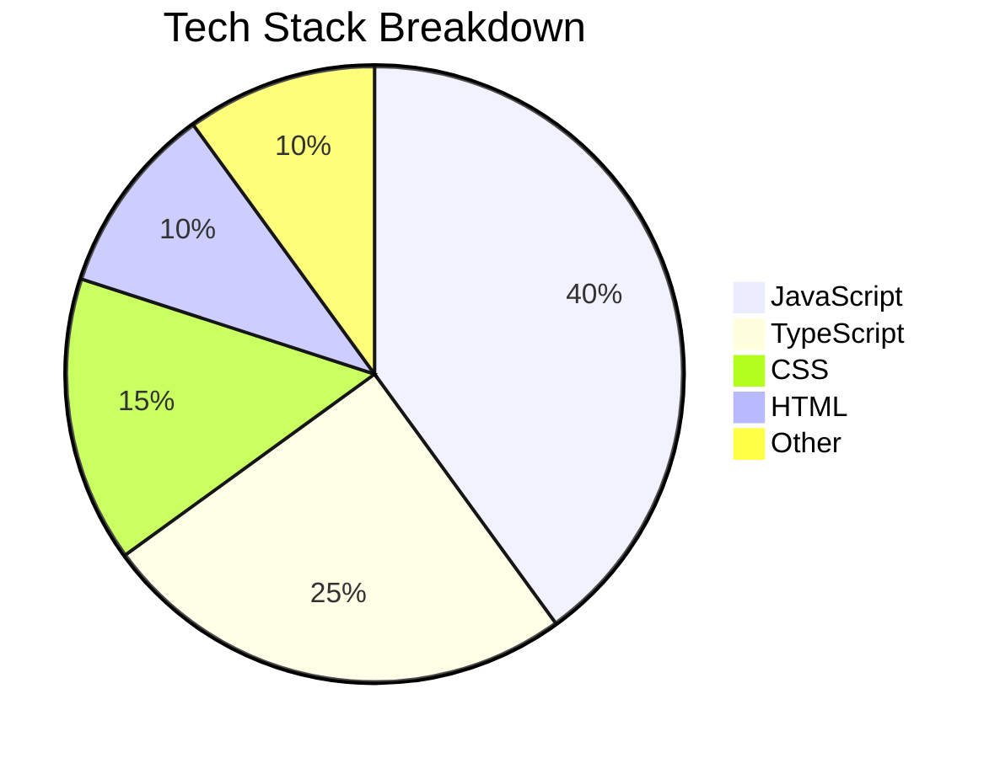
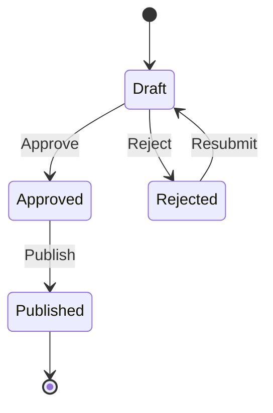
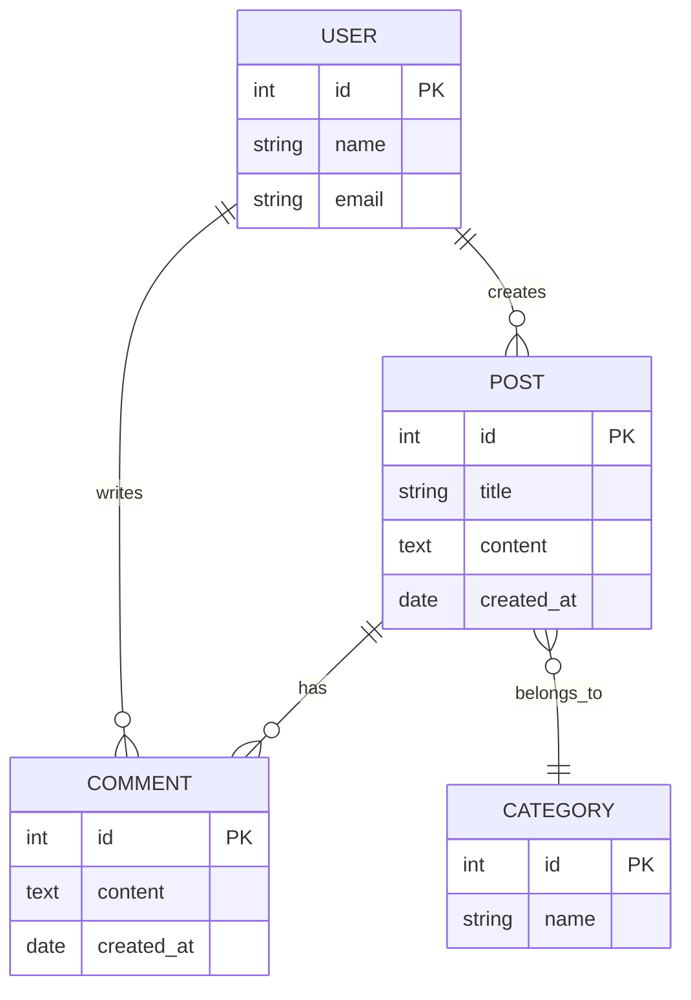

Mermaid is a JavaScript-based diagramming tool that uses Markdown-inspired text definitions and a renderer to create and modify complex diagrams. Simply use the ` ```mermaid ` code block in your articles to render them automatically.

## Flowchart



## Sequence Diagram



## Class Diagram



## Gantt Chart



## Pie Chart



## State Diagram



## ER Diagram



## Summary

| Diagram Type | Use Cases |
|----------|----------|
| Flowchart | Business processes, decision logic |
| Sequence Diagram | Component interactions, API calls |
| Class Diagram | Object-oriented design |
| Gantt Chart | Project management, timeline planning |
| Pie Chart | Data visualization |
| State Diagram | State transitions |
| ER Diagram | Database design |

Mermaid diagrams automatically adapt to dark mode and follow the site's active theme.
