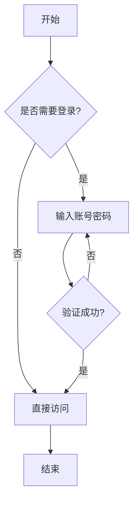
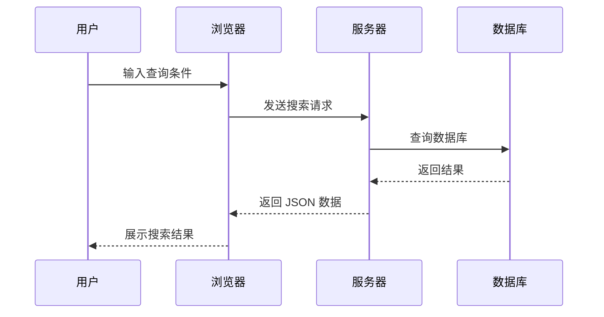
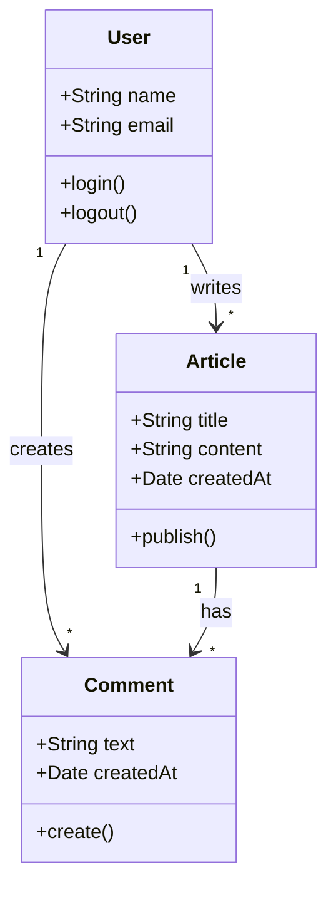
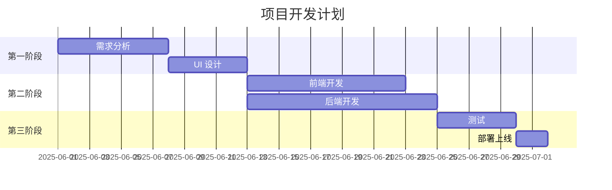
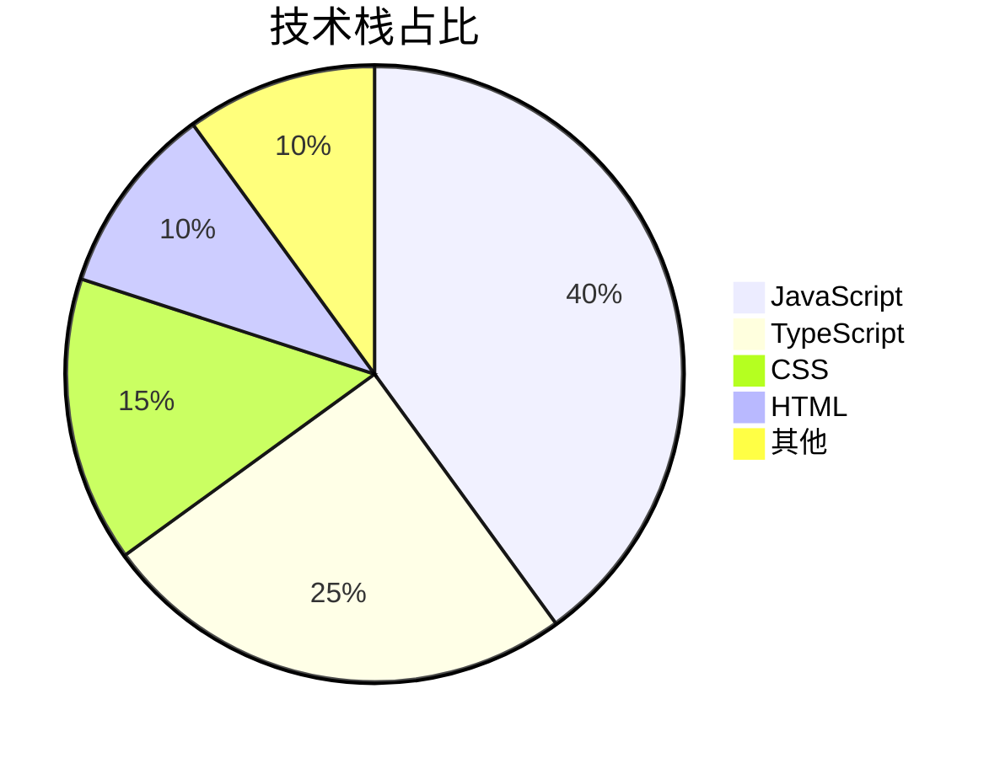
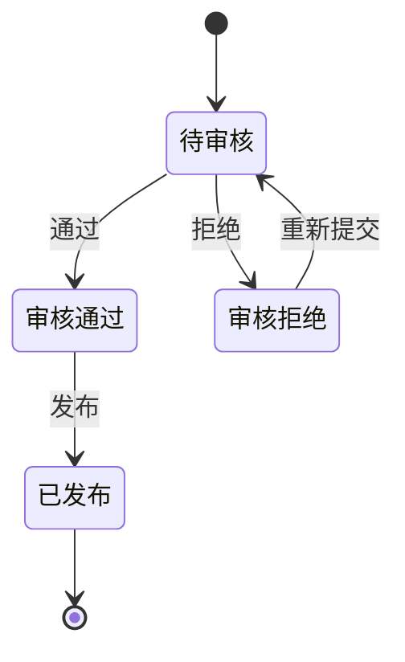
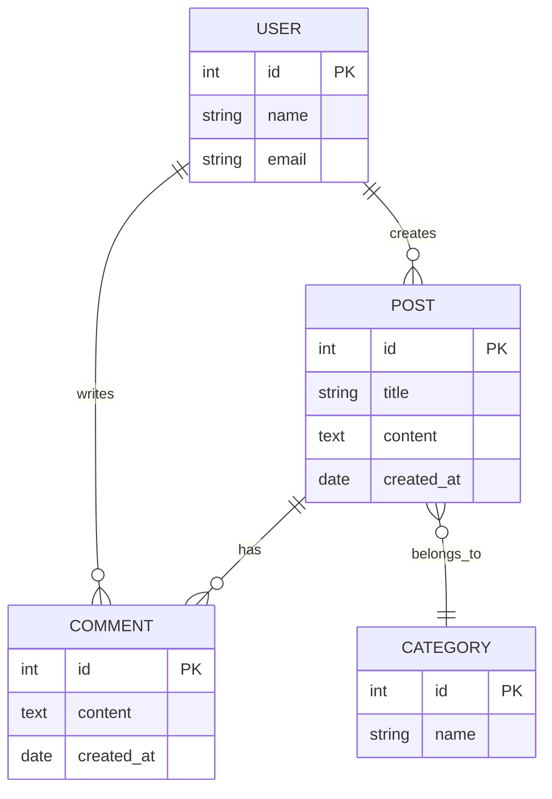

Mermaid 是一个基于 JavaScript 的图表绘制工具，可以通过类似 Markdown 的语法生成各种图表。在文章中使用 ` ```mermaid ` 代码块即可自动渲染。

## 流程图



## 序列图



## 类图



## 甘特图



## 饼图



## 状态图



## ER 图



## 总结

| 图表类型 | 适用场景 |
|----------|----------|
| 流程图 | 业务流程、决策逻辑 |
| 序列图 | 组件间交互、API 调用 |
| 类图 | 面向对象设计 |
| 甘特图 | 项目管理、时间规划 |
| 饼图 | 数据可视化 |
| 状态图 | 状态转换 |
| ER 图 | 数据库设计 |

Mermaid 图表自动适配暗色模式，主题跟随站点主题切换。
