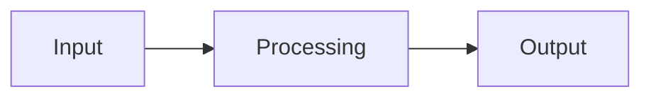

## Dark Mode

Click the sun/moon icon on the right side of the Header to switch between light and dark modes.

- Automatically follows system preference
- Manual selections are saved to `localStorage`
- Applied before page load to avoid flickering
- All components are fully adapted to both modes

Implementation principle: Controlled via the `.dark` class on the `<html>` element, using CSS variables to switch colors:

```css
:root {
  --color-bg: #f5f5f5;
  --color-text: #2c3e50;
}

:root.dark {
  --color-bg: #1a1a2e;
  --color-text: #e8e8e8;
}
```

## Site Search

Press `Ctrl+K` or click the search icon to open the search panel.

- Search by title, description, category, tags, and article body
- Multi-keyword AND matching
- Matching words are highlighted
- Contextual snippet preview
- Up to 20 results returned

## Table of Contents

The desktop layout displays an automatically generated Table of Contents (based on h2/h3 headings) on the right.

- Automatically highlights the current reading position while scrolling
- Click to smoothly scroll to the corresponding section
- Mobile users can open it via the bottom "TOC" drawer button, supporting ESC to close

## Reading Progress

A thin progress bar at the top of the post details page updates dynamically as you scroll, showing how far you have read.

## Share Buttons

Several sharing options are available at the bottom of each post:

| Method | Description |
|------|------|
| Twitter/X | Share to Twitter with one click |
| WeChat | Hover to show QR Code on desktop, tap on mobile |
| Copy Link | Copy post URL to clipboard |
| Native Share | Invoke system sharing sheet on mobile devices |

## Series

Group related posts together using the `series` field in the frontmatter:

```yaml
---
series: Astro Tutorial
---
```

A list of posts in the same series will automatically show in the sidebar, with the current post highlighted.

## Comments

Uses the Waline comment system, supporting:

- Nicknames / Emails / Websites
- Markdown syntax
- Automatic dark mode adaptivity
- Configured via server address in `src/components/waline/Comment.astro`

## Friend Links

Manage friend links by editing `public/links.json`. The friend links page features:

- Cards showing friend's avatar, name, and bio
- Connectivity status check (automatically tests if the site is reachable, indicating status with green/red indicator)
- Friend circle dynamics (requires `friendCircleServer` backend)
- Dedicated Special Recommendations section

## i18n Internationalization

Click the "中/EN" language button on the right side of the Header to switch languages.

- Supports English and Chinese
- Header/Footer and navigation text are translated automatically
- Language preference saved in `localStorage.locale`
- Translations located in `src/i18n/zh.ts` and `src/i18n/en.ts`

## Code Block Enhancements

All code blocks automatically feature:

- **Language Labels**: Shows the language name at the top-left corner
- **One-click Copy**: A copy button at the top-right corner (turns into ✓ when copied)
- **Line Numbers**: Line numbers displayed on the left
- **Dual Themes**: Automatically matches site theme (light/dark colors)

## Mermaid Diagrams

Insert diagrams by writing a ` ```mermaid ` code block:

```markdown

```

Supports flowcharts, sequence diagrams, class diagrams, Gantt charts, pie charts, state diagrams, ER diagrams, etc. Automatically adapts to dark mode.

## RSS Feed

Automatically generates `/rss.xml` containing all published posts. Subscription links are available in Header social icons and page `<head>`.

## SEO Optimization

Each page is injected with complete SEO metadata:

| Meta Tag | Source |
|-----------|------|
| `<title>` | `frontmatter.title + Site Title` |
| `<meta description>` | `frontmatter.description` |
| `og:title / og:image` | Post Title / Cover Image |
| `twitter:card` | `summary_large_image` |
| JSON-LD | Structured data (Article / WebPage) |

## PWA Support

The blog can be installed as a PWA on desktops or mobile phones:

- Service Worker caches static assets
- Access cached pages offline
- Add to Home Screen support

## Back to Top

A Back to Top button appears at the bottom-right corner when scrolling past 300px. Click to smoothly scroll back to the top.
